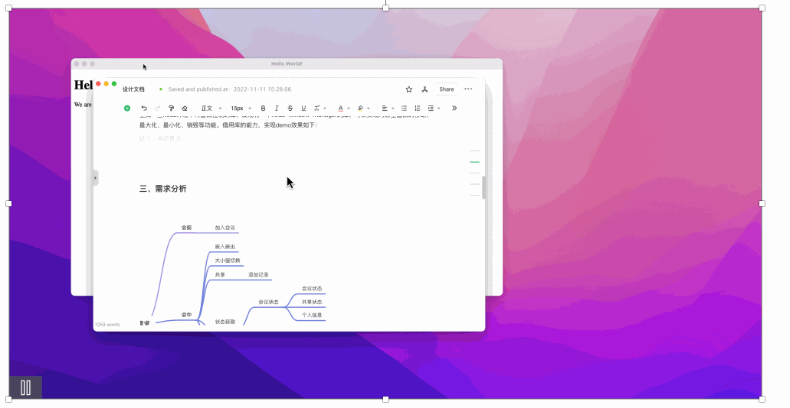
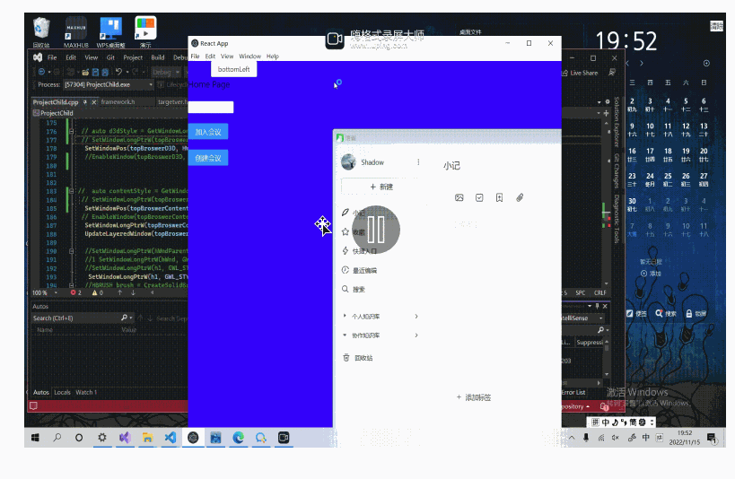
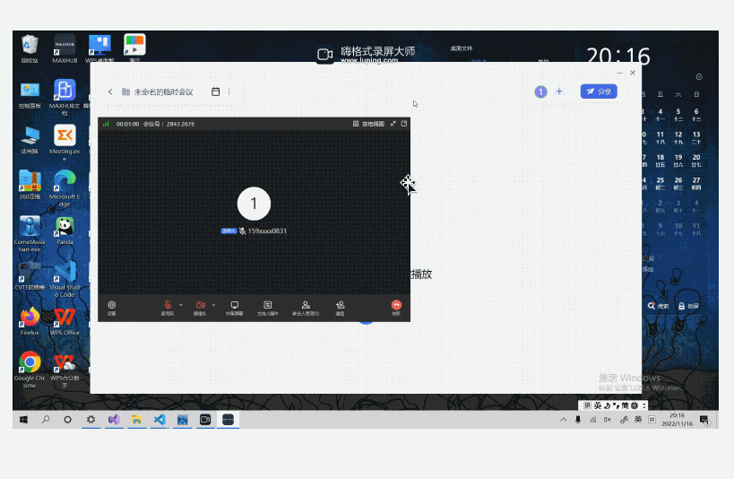

#### Description of the problem:

To embed a native window into an electron application.

#### Background:

I'm currently working on developing multimedia module. By using a meeting SDK, I've managed to integrate features like voice and video calls, as well as screen sharing, into the app. Here’s how the rendering process works: As shown in the diagram,

the TM-SDK is located in the service process, while the main video window and the sharing window are in two separate processes. Data is transferred between these processes through a publish-subscribe pattern. The data flow involves converting YUV420 format to RGB, which is then rendered on a canvas.

However, there are a couple of issues with this setup:

Transferring data between processes involves continuously allocating and copying memory, which leads to performance degradation.
Users experience dropped frames and lag, indicating that the canvas rendering needs optimization. The quality isn’t as good as native rendering.

So, I'm thinking about using an embedded UISDK in the new plan:
The advantages are:

- The meeting solution on the SDK is well-established and has low maintenance costs;
- Native rendering offers better performance than web page rendering;
- It uses less CPU and has lower performance overhead.

The challenges are:

- Embedding a native window in Electron involves knowledge of V8, addons, and C++;
- The SDK has different versions for Windows and Mac, which requires consideration of how to adapt different SDKs accordingly.

#### Technology Selection

##### current situation:

First of all, electron does not offer APIs to embedd native windows. Here is the document:
Embed External Native Windows #10547

> https://github.com/electron/electron/issues/10547

Then, it has to be doing some research before next step. Here are some key materials:

The first one is: Youku Player optimization practice (VI) -- Electron cross-platform advancement: Native player integration

> https://developer.aliyun.com/article/829878

The document reveals that Youku's player optimization also embeds a native window within the Electron framework. Their approach utilizes Electron's capabilities to handle basic UI elements like playback controls and comment overlays, while the native player focuses solely on the fundamental tasks of video decoding and rendering. By using the `getNativeWindowHandle` API, they can obtain a pointer to the window object specific to the platform (Buffer), convert this Buffer into a Long type, and pass it to the C++ SDK to set up a parent-child window relationship, thus embedding the rendering window into the BrowserWindow.

The article suggests a strategy: implementing a C++ extension in Node to facilitate window embedding. However, it doesn't specify which system API to use, but it does confirm the feasibility of this requirement.

the second article is about the parent window and the child window, you will learn about the Win32 API `SetParent`. By using `SetParent`, you establish a foundational relationship between a parent and a child window. 
>https://developer.aliyun.com/article/246621 

This relationship means that the child window will follow the parent window's actions, such as moving, minimizing, maximizing, or closing. This behavior typically meets the needs of most applications, making SetParent a crucial API for managing windows.

However, using `SetParent` can introduce some challenges, particularly with UI rendering. When SetParent is applied, it forces the message loops between the two windows into a single queue. This setup can cause the UI threads of different processes to wait on each other, leading to delays in rendering the child window.
> What is the documentation for SetParent trying to tell me about synchronizing the UI state?
> https://devblogs.microsoft.com/oldnewthing/20171122-00/?p=97445

To address these issues, you can use the window styles `WS_CLIPCHILDREN` and `WS_CLIPSIBLINGS`. These styles help manage how windows are drawn and updated, preventing conflicts in the UI thread that could cause performance problems. 
> https://www.cnblogs.com/helloj2ee/archive/2009/05/29/1491822.html

#### Solutions
##### thinking#1:from UI aspect
First of all, the goal is to have the child float above the main window. By monitoring the status of the main window, the child will follow its actions—whether it's moving, maximizing, minimizing, or closing. This creates an effect that makes it seem as though they're embedded.  The `node-window-manager` (npm package) allows for moving, maximizing, minimizing, and closing native windows. This is the demo:

The delay is obvious, and it dose not meet our expectation.  

##### thinking#2: from system API aspect
While exploring the Win32 API, I discovered that the `SetParent` function allows you to embed Window A into Window B using window handles. However, this approach introduces a problem, as demonstrated below: 

By obtaining the handles of two windows and setting up a parent-child relationship with `SetParent`, we can achieve the embedding effect. The child window responds interactively without any resizing of the parent window. But when the parent window is resized, the child window stops responding and rendering.

Upon analyzing this issue, the initial focus was on the inability of the message queues in the thread of the two process windows to synchronize, leading to a freeze. When `SetParent` is used, the message loops of the parent-child windows are forcibly serialized into one queue. This causes all UI threads of the processes to wait for each other, preventing any code executed through the message loop from running concurrently, thus causing the rendering to freeze.

After several attempts, I finally found a solution. First, the parent window, as the top-level window, needs its `GWL_STYLE` property set to `WS_CLIPCHILDREN`, which clips the child windows, meaning the parent window won't interfere with the child's rendering. Secondly, the child window's `GWL_STYLE` should be set to `WS_CLIPSIBLINGS`, which clips sibling windows, ensuring it doesn't interfere with overlapping sibling windows. See the demo for illustration.

